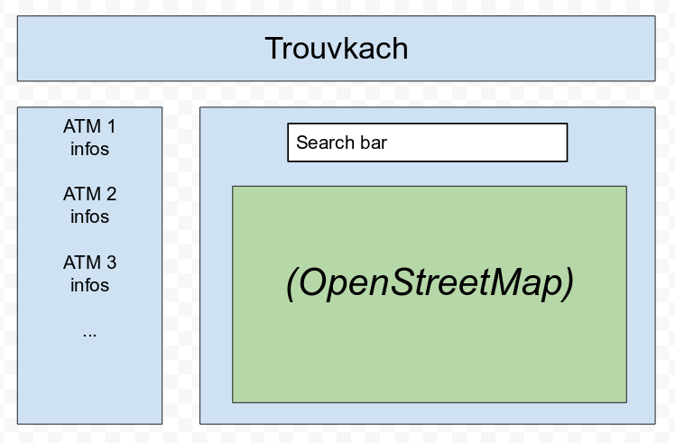

# Node.JS: BeCode TrouvKach
***
> A simple react/node app, locating the ATMs nearby.

***

- Type of challenge: **consolidation for React, Learning for MongoDB**
- Repository : **`trouvkach`**
- Deadline : **13/12/2019 5:00 pm**
- Team : **John Dillinger** Nicolas B, Maxime C, Michaël, Yousef
- Heroku (demo link) : https://whispering-badlands-01746.herokuapp.com/

## Specifications

For this project we were using :
- React (component class definition)
- React Leaflet (OpenStreetMap)
- Axios (client side routing)
- Express (server side routing)
- MongoDB hosted on Atlas
- W3C Geolocation
- Heroku

### Difficulties

How to :
- connect to the database (MongoDB and/or mongoose)
- create correct queries to the database
- be able to use/manipulate datas between server side and client side
- define and use environment variables with Node Express and Heroku (.env file in Docker)
- correctly push the project on Heroku
-

### Technical constraint (NOK)

- Leaflet (customized markers)
- Fingerprint (delete ATMs)
-

#### Mockups & Design

